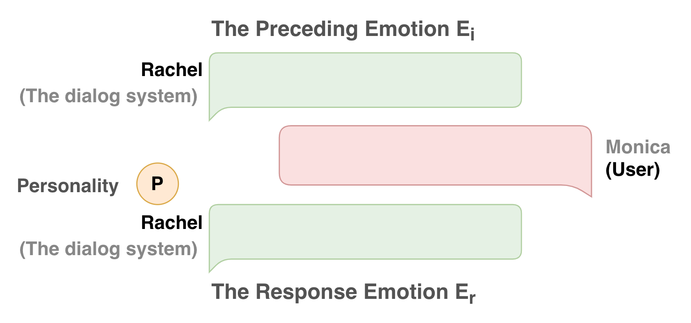
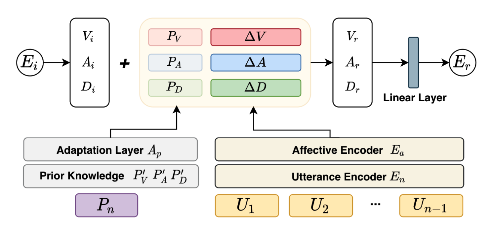
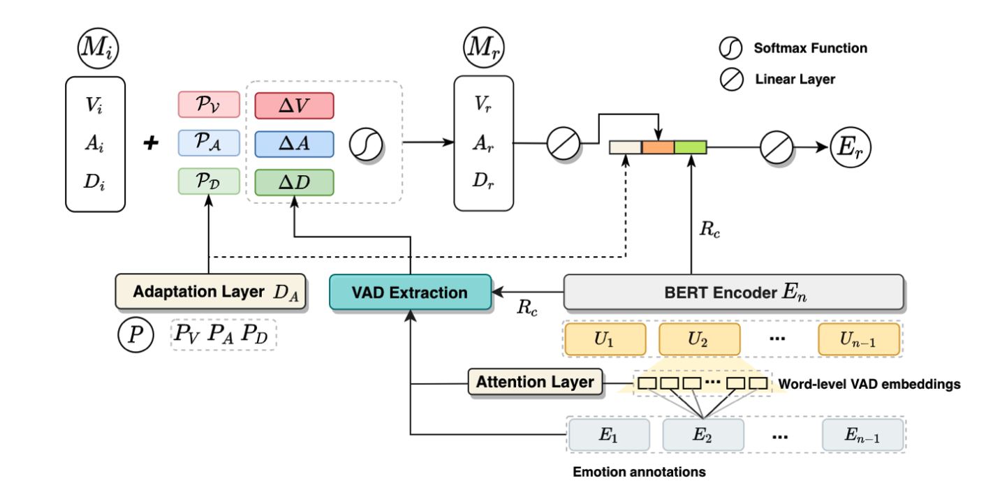

##  Personality EmotionLine Dataset (PELD)

PELD is a text-based emotional dialog dataset with personality traits for speakers. 

The dialogues in PELD are merged from the emotional dialogues in [MELD and EmoryNLP](https://github.com/declare-lab/MELD) , as well as the personality trait annotations from [FriendsPersona](https://github.com/emorynlp/personality-detection).


The personality traits in PELD are adopted from the personality annotations in 711 different dialogues in  [FriendsPersona](https://github.com/emorynlp/personality-detection). Refer to the annotations, a role may exhibit different aspects of its personality in different dialogues. 

We only keep the personality traits of the six main roles for confidence as their annotations are most frequent. For each of the main roles, we average their annotated personality traits in all the dialogues by $P_n = \\frac{1}{K}\\sum_{i=1}^K{P_i}$ for simplification, where $K$ is the number of annotations.

|Roles|Personality Traits (O,C,E,A,N)|
|---|---|
|Chandler | [0.648, 0.375, 0.386, 0.58, 0.477]|
|Joey | [0.574, 0.614, 0.297, 0.545, 0.455]|
|Monica | [0.713, 0.457, 0.457, 0.66, 0.511]|
|Phoebe | [0.6, 0.48, 0.31, 0.46, 0.56]|
|Rachel | [0.635, 0.354, 0.521, 0.552, 0.469]|
|Ross | [0.722, 0.489, 0.6, 0.533, 0.356]|


We construct dialog triple samples as below in our dataset:



We propose two method to generate the response emotion $E_r$ as below:

## Emotion Transition 





## Mood Transition




## Citation

[Automatically Select Emotion for Response via Personality-affected Emotion Transition](https://aclanthology.org/2021.findings-acl.444) 

Zhiyuan Wen | Jiannong Cao | Ruosong Yang | Shuaiqi Liu | Jiaxing Shen

```bib
@inproceedings{wen-etal-2021-automatically,
    title = "Automatically Select Emotion for Response via Personality-affected Emotion Transition",
    author = "Wen, Zhiyuan  and
      Cao, Jiannong  and
      Yang, Ruosong  and
      Liu, Shuaiqi  and
      Shen, Jiaxing",
    booktitle = "Findings of the Association for Computational Linguistics: ACL-IJCNLP 2021",
    month = aug,
    year = "2021",
    address = "Online",
    publisher = "Association for Computational Linguistics",
    url = "https://aclanthology.org/2021.findings-acl.444",
    doi = "10.18653/v1/2021.findings-acl.444",
    pages = "5010--5020",
}
```


